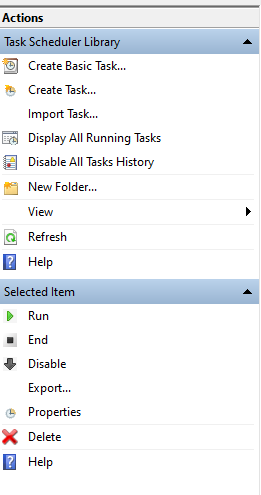

Frequently, we as researchers would like to expedite our work process with programs when we have repeated tasks. There is an easy way for you to do this with Python on your Windows computer.

Steps:

1.  Create your python file: `file.py`
2.  Create your bat file to call your environment and the python scrip: `file.bat` (typically we edit in "Notepad")

```{r, eval = FALSE}
call activate "C:\Users\user_name\Anaconda3\envs\envs_name"
python "C:\Users\...\file.py"
call conda deactivate
```

3.  Search for "Task Scheduler"
4.  On the right-hand side, you will see "Create Basic Task"



5.  Follow the steps until "Action", pick "Start a program"
6.  Browse your `file.bat` and finish
